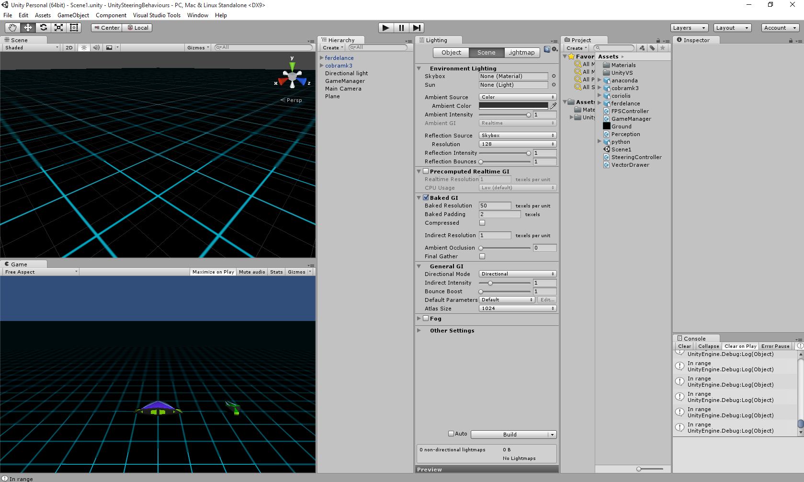

# DT228/DT211 Game Engines 1

## Resources
* [Slack](gameengines2015.slack.com)
* [Webcourses](http://dit.ie/webcourses)
* [Download Unity](http://processing.org)
* [Download Visual Studio 2015](http://processing.org/reference/)
* [Download Visual Studio Tools for Unity](http://processing.org/reference/)
* [Games Fleadh](http://www.gamesfleadh.ie/)
* [The Imagine Cup](https://www.imaginecup.com/)
* [The git manual - read the first three chapters](http://git-scm.com/documentation)
* [A video tutorial all about git/github](https://www.youtube.com/watch?v=p_PGUltnB6w)
* [Lecture notes](https://onedrive.live.com/redir?resid=AB603D769EDBF24E!263984&authkey=!AE-BvjCbphg3dOs&ithint=folder%2clnk)

## Contact the lecturer
* Email: bryan.duggan@dit.ie
* Twitter: [@skooter500](http://twitter.com/skooter500)
* Slack: https://gameengines2015.slack.com

## Week 2
## Lab
### Learning outcomes
- Clone a git repository
- Become familiar with the Unity3D editor
- Create game objects from 3D models
- Attach a new game component to a game objects
- Implement some simple keyboard handling code
- Know where the Unity3D tutorial videos are

The aim of this lab is to set up a new scene in Unity3D that looks like the scene below and to implement some simple keyboard handling behaviour to move a 3D model around the scene:



Firstly clone the repository for the course. To do this, fire up the bash shell and type:

```bash
git clone https://github.com/skooter500/gameengines2015
```

-Now start Unity3D and open the project folder Vectors1 from the unity folder in the repo you just cloned. All the assets you need to complete the project are included.
-Create a new, empty scene
-Add a camera and attach the FPSController component. Its a C# component that is one of the project assets.
-Add a plane. 
-Scale the plane to 50 1 50, so that it fills a flat area of 50 x 50
-Texture the plane with the ground texture. To do this you can just drag the texture from the project assets onto the plane.
-Now create the two models. To do this, you have to just drag the models from the project assets onto the scene. The model on the left is cobra mk3 and the model on the right is called a ferdelance.
-Attach a new game component to the cobra mk3 and have a go at implementing a behaviour that causes the ship to move forward, backward, left and right in response to the arrow keys. This is how you detect key presses in Unity3D:

```C#
if (Input.GetKey(KeyCode.W))
{
	// Do some stuff
}
```

So I havent explained in class how to do most of this stuff, so use code completion in Visual Studio and just try some stuff and see if you can figure it out. At some stage you should watch the [Unity3D tutorial videos](https://unity3d.com/learn/tutorials/) to get started.

I suggest you watch at least these videos:
- [The Unity3D interface & essentials](https://unity3d.com/learn/tutorials/topics/interface-essentials)
- [Scripting](https://unity3d.com/learn/tutorials/topics/scripting)

## Week 1

- [Processing with GameComponents example](processing/YASCComponents)
- [Starter Unity3D project](unity/Vectors1)
- [The Processing sketch  we wrote in class to demonstrate game components](processing/YASCComponents)
- [A whole series of lectures I made about OOP in C# a few years ago](https://www.youtube.com/playlist?list=PL1n0B6z4e_E5aB2FqwrNRrhLyO0aqW_Bo)
- Objects & classes in C#

	[](https://www.youtube.com/watch?v=9hqcvnTuESo)

- Objects classes & references in C#

	[](https://www.youtube.com/watch?v=tAodHmlY7oI)

- C# Inheritance, static & dynamic binding

	[](https://www.youtube.com/watch?v=IMa3hXM1Rx8)

- Procedurally generated minnowforms video:

	[](https://www.youtube.com/watch?v=5G-PKD5GnlE)

- NILL One of my game jam games. It uses lots of nice come sci stuff like Perlin noise, procedural generation and binary search

	[](https://www.youtube.com/watch?v=RkReFavQbQo)

	[NILL Sourcecode](http://github.com/skooter500/NILL)

- Assignments from previous years:

	[](https://www.youtube.com/watch?v=ii049d7UFrg)

	[](https://www.youtube.com/watch?v=5BPxM--x-7M)

	[](https://www.youtube.com/watch?v=ii049d7UFrg)
